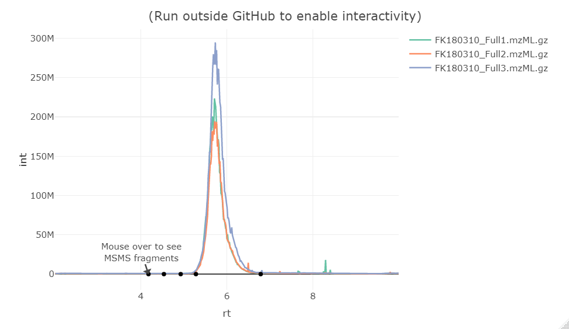

Rapid access to Mass-Spec data (RaMS)
================

## Overview

`RaMS` is a lightweight package that provides rapid and tidy access to
mass-spectrometry data. This package is *lightweight* because it’s built
from the ground up rather than relying on an extensive network of
external libraries. No Rcpp, no Bioconductor, no long load times and
strange startup warnings. Just XML parsing provided by `xml2` and data
handling provided by `data.table`. Access is *rapid* because an absolute
minimum of data processing occurs. Unlike other packages, `RaMS` makes
no assumptions about what you’d like to do with the data and is simply
providing access to the encoded information in an intuitive and
R-friendly way. Finally, the access is *tidy* in the philosophy of [tidy
data](https://r4ds.had.co.nz/tidy-data.html). Tidy data neatly resolves
the ragged arrays that mass spectrometers produce and plays nicely with
other [tidy data packages](https://www.tidyverse.org/).

## Installation

Until `RaMS` is on CRAN, the easiest way to install is via `devtools`:

``` r
devtools::install_github("wkumler/RaMS")

library(RaMS)
```

## Usage

There’s only one main function in `RaMS`: the aptly named `grabMSdata`.
This function accepts the names of mass-spectrometry files as well as
the data you’d like to extract (e.g. MS1, MS2, BPC, etc.) and produces a
list of data tables. Each table is intuitively named within the list and
formatted tidily:

``` r
demo_dir <- system.file("extdata", package = "RaMS")
msdata_files <- list.files(demo_dir, pattern = "mzML", full.names = TRUE)
output <- grabMSdata(files = msdata_files, grab_what = c("TIC", "MS1", "MS2"))
```

``` r
knitr::kable(head(output$TIC))
```

|       rt |      int | filename                    |
| -------: | -------: | :-------------------------- |
| 4.002279 | 63075520 | FK180310\_DDApos100.mzML.gz |
| 4.006146 | 70261912 | FK180310\_DDApos100.mzML.gz |
| 4.009863 | 67087636 | FK180310\_DDApos100.mzML.gz |
| 4.014958 | 65778432 | FK180310\_DDApos100.mzML.gz |
| 4.019046 | 69721400 | FK180310\_DDApos100.mzML.gz |
| 4.023031 | 64959804 | FK180310\_DDApos100.mzML.gz |

``` r
knitr::kable(head(output$MS1))
```

|       rt |       mz |        int | filename                    |
| -------: | -------: | ---------: | :-------------------------- |
| 4.002279 | 60.04510 | 281799.594 | FK180310\_DDApos100.mzML.gz |
| 4.002279 | 60.05633 |   9898.172 | FK180310\_DDApos100.mzML.gz |
| 4.002279 | 60.05814 |  21629.547 | FK180310\_DDApos100.mzML.gz |
| 4.002279 | 60.06444 |  71579.758 | FK180310\_DDApos100.mzML.gz |
| 4.002279 | 60.08151 |  10134.972 | FK180310\_DDApos100.mzML.gz |
| 4.002279 | 61.04036 |  73980.500 | FK180310\_DDApos100.mzML.gz |

``` r
knitr::kable(head(output$MS2))
```

|       rt |    premz |   fragmz |      int | voltages | filename                    |
| -------: | -------: | -------: | -------: | -------: | :-------------------------- |
| 4.012270 | 757.0170 | 57.46079 | 6493.131 |      100 | FK180310\_DDApos100.mzML.gz |
| 4.012270 | 757.0170 | 59.75748 | 6986.794 |      100 | FK180310\_DDApos100.mzML.gz |
| 4.012270 | 757.0170 | 62.73330 | 7692.589 |      100 | FK180310\_DDApos100.mzML.gz |
| 4.012270 | 757.0170 | 81.37758 | 6411.755 |      100 | FK180310\_DDApos100.mzML.gz |
| 4.074476 | 493.0172 | 51.06575 | 7378.653 |      100 | FK180310\_DDApos100.mzML.gz |
| 4.074476 | 493.0172 | 53.40517 | 6472.478 |      100 | FK180310\_DDApos100.mzML.gz |

This means that basic R functions work exactly as we expect them to, no
new functionality necessary:

``` r
# Outputs are data.tables so we can use their intuitive indexing on column name
first_file_data <- output$TIC[filename==basename(msdata_files[2])]
plot(first_file_data$rt, first_file_data$int, type = "l")
```

<!-- -->

-----

And of course, the tidy data format means that it plays nicely with
every other tidy data package.

### Chromatograms with ggplot2

``` r
output <- grabMSdata(files = msdata_files[-1], grab_what = c("TIC", "MS1"))
```

``` r
library(ggplot2)
ggplot(output$TIC) + geom_line(aes(x = rt, y=int, color=filename)) + theme(legend.position="top")
```

<!-- -->

``` r
ggplot(output$TIC) + geom_line(aes(x = rt, y=int)) +
  facet_wrap(~filename, scales = "free_y", ncol = 1) +
  labs(x="Retention time (min)", y="Intensity")
```

<!-- -->

### Interactive MSMS with dplyr, stringr, and plotly

``` r
output <- grabMSdata(files = msdata_files, grab_what = c("EIC", "EIC_MS2"),
                     mz=118.0865, ppm=5)

library(dplyr)
library(stringr)
library(plotly)

clean_EIC_MS2 <- output$EIC_MS2 %>% 
  group_by(rt) %>%
  arrange(desc(int)) %>%
  summarise(frags=paste(
    paste(round(fragmz, digits = 3), round(int), sep = ": "), collapse = "\n")
  )
output$EIC %>% 
  filter(!str_detect(filename, "DDA")) %>%
  plot_ly() %>%
  add_trace(type="scatter", mode="lines", x=~rt, y=~int, color=~filename,
            hoverinfo="none") %>%
  add_trace(type="scatter", mode="markers", x=~rt, y=0,
            text=~frags, hoverinfo="text", showlegend=FALSE,
            marker=list(color="black"), data = clean_EIC_MS2) %>%
  layout(annotations=list(x=min(clean_EIC_MS2$rt), y=0, 
                          text="Mouse over to see\nMSMS fragments"),
         title="(Run outside GitHub to enable interactivity)")
```



## File types

RaMS is currently limited to the modern **mzML** data format and the
slightly older **mzXML** format. Tools to convert data from other
formats are available through
[Proteowizard](http://proteowizard.sourceforge.net/tools.shtml)’s
`msconvert` tool. Data can, however, be gzip compressed (file ending
.gz) and this compression actually speeds up data retrieval
significantly as well as reducing file sizes.

Currently, `RaMS` also handles only MS<sup>1</sup> and MS<sup>2</sup>
data. This should be easy enough to expand in the future, but right now
I haven’t observed a demonstrated need for higher fragmentation level
data collection.
