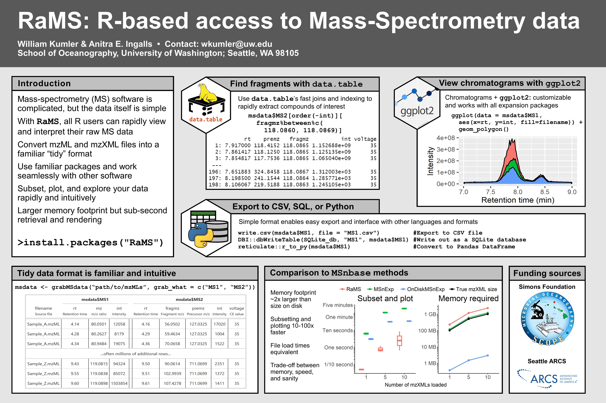
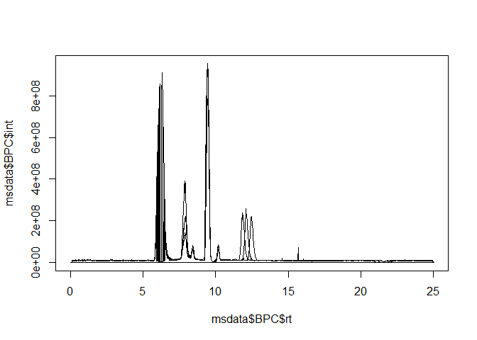
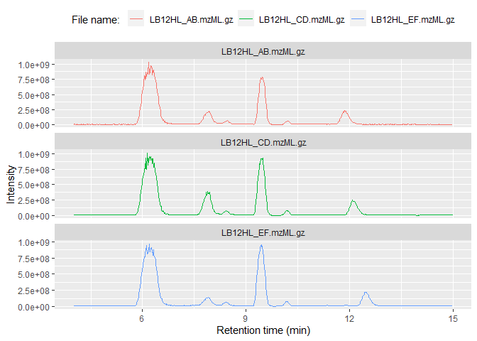
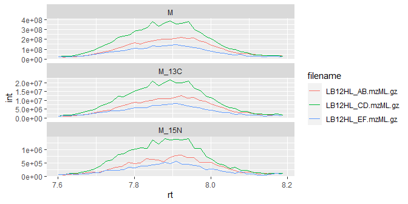
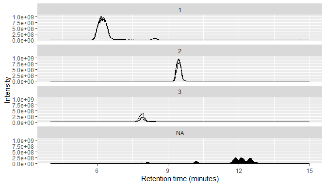
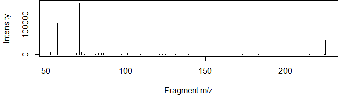

<!-- README.md is generated from README.Rmd. Please edit that file -->

# R-based access to Mass-Spec data (RaMS) 

<!-- badges: start -->

[](https://github.com/wkumler/RaMS/actions/)
[](https://app.codecov.io/gh/wkumler/RaMS)
<!-- badges: end -->

**Table of contents:** [Overview](.#overview) -
[Installation](.#installation) - [Usage](.#usage) - [File
types](.#file-types) - [Contact](.#contact)

## Overview

`RaMS` is a lightweight package that provides rapid and tidy access to
mass-spectrometry data. This package is *lightweight* because it’s built
from the ground up rather than relying on an extensive network of
external libraries. No Rcpp, no Bioconductor, no long load times and
strange startup warnings. Just XML parsing provided by `xml2` and data
handling provided by `data.table`. Access is *rapid* because an absolute
minimum of data processing occurs. Unlike other packages, `RaMS` makes
no assumptions about what you’d like to do with the data and is simply
providing access to the encoded information in an intuitive and
R-friendly way. Finally, the access is *tidy* in the philosophy of [tidy
data](https://r4ds.had.co.nz/tidy-data.html). Tidy data neatly resolves
the ragged arrays that mass spectrometers produce and plays nicely with
other [tidy data packages](https://www.tidyverse.org/).

<figure>

<figcaption aria-hidden="true">RaMS quick-start poster from Metabolomics
Society conference 2021</figcaption>
</figure>

## Installation

To install the stable version on CRAN:

``` r
install.packages('RaMS')
```

To install the current development version:

``` r
devtools::install_github("wkumler/RaMS", build_vignettes = TRUE)
```

Finally, load RaMS like every other package:

``` r
library(RaMS)
```

## Usage

There’s only one main function in `RaMS`: the aptly named `grabMSdata`.
This function accepts the names of mass-spectrometry files as well as
the data you’d like to extract (e.g. MS1, MS2, BPC, etc.) and produces a
list of data tables. Each table is intuitively named within the list and
formatted tidily:

``` r
msdata_dir <- system.file("extdata", package = "RaMS")
msdata_files <- list.files(msdata_dir, pattern = "mzML", full.names=TRUE)

msdata <- grabMSdata(files = msdata_files[2:4], grab_what = c("BPC", "MS1"))
```

Some additional examples can be found below, but a more thorough
introduction can be found in [the
vignette](https://cran.r-project.org/package=RaMS/vignettes/Intro-to-RaMS.html)
or by typing `vignette("Intro-to-RaMS", package = "RaMS")` in the R
console after installation.

#### BPC/TIC data:

Base peak chromatograms (BPCs) and total ion chromatograms (TICs) have
three columns, making them super-simple to plot with either base R or
the popular [ggplot2](https://cran.r-project.org/package=ggplot2)
library:

``` r
knitr::kable(head(msdata$BPC, 3))
```

|       rt |      int | filename          |
|---------:|---------:|:------------------|
| 4.009000 | 11141859 | LB12HL_AB.mzML.gz |
| 4.024533 |  9982309 | LB12HL_AB.mzML.gz |
| 4.040133 | 10653922 | LB12HL_AB.mzML.gz |

``` r
plot(msdata$BPC$rt, msdata$BPC$int, type = "l", ylab="Intensity")
```

<!-- -->

``` r
library(ggplot2)
ggplot(msdata$BPC) + geom_line(aes(x = rt, y=int, color=filename)) +
  facet_wrap(~filename, scales = "free_y", ncol = 1) +
  labs(x="Retention time (min)", y="Intensity", color="File name: ") +
  theme(legend.position="top")
```

<!-- -->

#### MS1 data:

MS<sup>1</sup> data includes an additional dimension, the *m/z* of each
ion measured, and has multiple entries per retention time:

``` r
knitr::kable(head(msdata$MS1, 3))
```

|    rt |       mz |        int | filename          |
|------:|---------:|-----------:|:------------------|
| 4.009 | 139.0503 | 1800550.12 | LB12HL_AB.mzML.gz |
| 4.009 | 148.0967 |  206310.81 | LB12HL_AB.mzML.gz |
| 4.009 | 136.0618 |   71907.15 | LB12HL_AB.mzML.gz |

This tidy format means that it plays nicely with other tidy data
packages. Here, we use
[data.table](https://cran.r-project.org/package=data.table) and a few
other tidyverse packages to compare a molecule’s <sup>13</sup>C and
<sup>15</sup>N peak areas to that of the base peak, giving us some clue
as to its molecular formula. Note also the use of the `trapz` function
(available in v1.3.2+) to calculate the area of the peak given the
retention time and intensity values.

``` r
library(data.table)
library(tidyverse)

M <- 118.0865
M_13C <- M + 1.003355
M_15N <- M + 0.997035

iso_data <- imap_dfr(lst(M, M_13C, M_15N), function(mass, isotope){
  peak_data <- msdata$MS1[mz%between%pmppm(mass) & rt%between%c(7.6, 8.2)]
  cbind(peak_data, isotope)
})

iso_data %>%
  group_by(filename, isotope) %>%
  summarise(area=trapz(rt, int)) %>%
  pivot_wider(names_from = isotope, values_from = area) %>%
  mutate(ratio_13C_12C = M_13C/M) %>%
  mutate(ratio_15N_14N = M_15N/M) %>%
  select(filename, contains("ratio")) %>%
  pivot_longer(cols = contains("ratio"), names_to = "isotope") %>%
  group_by(isotope) %>%
  summarize(avg_ratio = mean(value), sd_ratio = sd(value), .groups="drop") %>%
  mutate(isotope=str_extract(isotope, "(?<=_).*(?=_)")) %>%
  knitr::kable()
```

| isotope | avg_ratio |  sd_ratio |
|:--------|----------:|----------:|
| 13C     | 0.0544072 | 0.0005925 |
| 15N     | 0.0033611 | 0.0001578 |

With [natural
abundances](https://en.wikipedia.org/wiki/Natural_abundance) for
<sup>13</sup>C and <sup>15</sup>N of 1.11% and 0.36%, respectively, we
can conclude that this molecule likely has five carbons and a single
nitrogen.

Of course, it’s always a good idea to plot the peaks and perform a
manual check of data quality:

``` r
ggplot(iso_data) +
  geom_line(aes(x=rt, y=int, color=filename)) +
  facet_wrap(~isotope, scales = "free_y", ncol = 1)
```

<!-- -->

MS<sup>1</sup> data typically consists of many individual chromatograms,
so RaMS provides a small function that can bin it into chromatograms
based on *m/z* windows.

``` r
msdata$MS1 %>%
  arrange(desc(int)) %>%
  mutate(mz_group=mz_group(mz, ppm=10, max_groups = 3)) %>%
  qplotMS1data(facet_col = "mz_group")
```

<!-- -->

We also use the `qplotMS1data` function above, which wraps the typical
`ggplot` call to avoid needing to type out
`ggplot() + geom_line(aes(x=rt, y=int, group=filename))` every time.
Both the `mz_group` and `qplotMS1data` functions were added in RaMS
version 1.3.2.

#### MS2 data:

DDA (fragmentation) data can also be extracted, allowing rapid and
intuitive searches for fragments or neutral losses:

``` r
msdata <- grabMSdata(files = msdata_files[1], grab_what = "MS2")
```

For example, we may be interested in the major fragments of a specific
molecule:

``` r
msdata$MS2[premz%between%pmppm(351.0817) & int>mean(int)] %>%
  plot(int~fragmz, type="h", data=., ylab="Intensity", xlab="Fragment m/z")
```

<!-- -->

Or want to search for precursors with a specific neutral loss above a
certain intensity:

``` r
msdata$MS2[, neutral_loss:=premz-fragmz][int>1e4] %>%
  filter(neutral_loss%between%pmppm(126.1408, 5)) %>%
  head(3) %>% knitr::kable()
```

| rt | premz | fragmz | int | voltage | filename | neutral_loss |
|---:|---:|---:|---:|---:|:---|---:|
| 47.27750 | 351.0817 | 224.9409 | 16333.23 | 40 | Blank_129I_1L_pos_20240207-MS3.mzML.gz | 126.1408 |
| 47.35267 | 351.0818 | 224.9410 | 27353.09 | 40 | Blank_129I_1L_pos_20240207-MS3.mzML.gz | 126.1408 |
| 47.42767 | 351.0818 | 224.9410 | 33843.92 | 40 | Blank_129I_1L_pos_20240207-MS3.mzML.gz | 126.1408 |

#### SRM/MRM data

Selected/multiple reaction monitoring files don’t have data stored in
the typical MSn format but instead encode their values as chromatograms.
To extract data in this format, include `"chroms"` in the `grab_what`
argument:

``` r
chromsdata <- grabMSdata(files = msdata_files[7], grab_what = "chroms", verbosity = 0)
```

which has individual reactions separated by the `chrom_type` column (and
the associated index) with relevant target/fragment data:

``` r
knitr::kable(head(chromsdata$chroms, 3))
```

| chrom_type | chrom_index | target_mz | product_mz |       rt | int | filename         |
|:-----------|:------------|----------:|-----------:|---------:|----:|:-----------------|
| TIC        | 0           |        NA |         NA | 2.000000 |   0 | wk_chrom.mzML.gz |
| TIC        | 0           |        NA |         NA | 2.048077 |   0 | wk_chrom.mzML.gz |
| TIC        | 0           |        NA |         NA | 2.096154 |   0 | wk_chrom.mzML.gz |

#### Minifying MS files

As of version 1.1.0, `RaMS` has functions that allow irrelevant data to
be removed from the file to reduce file sizes. See the
[vignette](https://cran.r-project.org/package=RaMS/vignettes/Minifying-files-with-RaMS.html)
for more details.

#### tmzML documents

Version 1.2.0 of RaMS introduced a new file type, the “transposed mzML”
or “tmzML” file to resolve the large memory requirement when working
with many files. See [the
vignette](https://cran.r-project.org/package=RaMS/vignettes/Intro-to-tmzML.html)
for more details, though note that I’ve largely deprecated this file
type in favor of proper database solutions as in the [speed & size
comparison
vignette](https://cran.r-project.org/package=RaMS/vignettes/speed_size_comparison.html).

## File types

RaMS is currently limited to the modern **mzML** data format and the
slightly older **mzXML** format. Tools to convert data from other
formats are available through
[Proteowizard’s](https://proteowizard.sourceforge.io/tools/msconvert.html)
`msconvert` tool. Data can, however, be gzip compressed (file ending
.gz) and this compression actually speeds up data retrieval
significantly as well as reducing file sizes.

Currently, `RaMS` handles MS<sup>1</sup>, MS<sup>2</sup>, and
MS<sup>3</sup> data. This should be easy enough to expand in the future,
but right now I haven’t observed a demonstrated need for higher
fragmentation level data collection.

Additionally, note that files can be streamed from the internet directly
if a URL is provided to `grabMSdata`, although this will usually take
longer than reading a file from disk:

``` r
## Not run:
# Find a file with a web browser:
browseURL("https://www.ebi.ac.uk/metabolights/MTBLS703/files")

# Copy link address by right-clicking "download" button:
sample_url <- paste0("https://www.ebi.ac.uk/metabolights/ws/studies/MTBLS703/",
                     "download/acefcd61-a634-4f35-9c3c-c572ade5acf3?file=",
                     "FILES/161024_Smp_LB12HL_AB_pos.mzXML")

msdata <- grabMSdata(sample_url, grab_what="everything", verbosity=2)
msdata$metadata
```

For an analysis of how RaMS compares to other methods of MS data access
and alternative file types, consider browsing the [speed & size
comparison
vignette](https://cran.r-project.org/package=RaMS/vignettes/speed_size_comparison.html).

## Contact

Feel free to submit questions, bugs, or feature requests on the [GitHub
Issues page](https://github.com/wkumler/RaMS/issues).

------------------------------------------------------------------------

README last built on 2025-07-29
