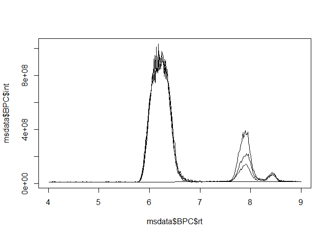
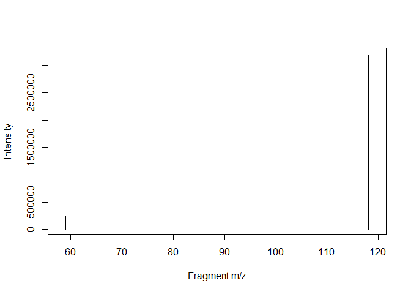

R-based access to Mass-Spec data (RaMS)
================

<!-- README.md is generated from README.Rmd. Please edit that file -->
<!-- badges: start -->

[](https://github.com/wkumler/RaMS/actions/)
[](https://codecov.io/gh/wkumler/RaMS)
<!-- badges: end -->

**Table of contents:**
[Overview](https://github.com/wkumler/RaMS#overview) -
[Installation](https://github.com/wkumler/RaMS#installation) -
[Usage](https://github.com/wkumler/RaMS#usage) - [File
types](https://github.com/wkumler/RaMS#file-types) -
[Contact](https://github.com/wkumler/RaMS#contact)

## Overview

`RaMS` is a lightweight package that provides rapid and tidy access to
mass-spectrometry data. This package is *lightweight* because it’s built
from the ground up rather than relying on an extensive network of
external libraries. No Rcpp, no Bioconductor, no long load times and
strange startup warnings. Just XML parsing provided by `xml2` and data
handling provided by `data.table`. Access is *rapid* because an absolute
minimum of data processing occurs. Unlike other packages, `RaMS` makes
no assumptions about what you’d like to do with the data and is simply
providing access to the encoded information in an intuitive and
R-friendly way. Finally, the access is *tidy* in the philosophy of [tidy
data](https://r4ds.had.co.nz/tidy-data.html). Tidy data neatly resolves
the ragged arrays that mass spectrometers produce and plays nicely with
other [tidy data packages](https://www.tidyverse.org/).

## Installation

To install the stable version on CRAN:

``` r
install.packages('RaMS')
```

To install the current development version:

``` r
devtools::install_github("wkumler/RaMS")
```

Finally, load RaMS like every other package:

``` r
library(RaMS)
```

## Usage

There’s only one main function in `RaMS`: the aptly named `grabMSdata`.
This function accepts the names of mass-spectrometry files as well as
the data you’d like to extract (e.g. MS1, MS2, BPC, etc.) and produces a
list of data tables. Each table is intuitively named within the list and
formatted tidily:

``` r
msdata_dir <- system.file("extdata", package = "RaMS")
msdata_files <- list.files(msdata_dir, pattern = "mzML", full.names=TRUE)

msdata <- grabMSdata(files = msdata_files[2:4], grab_what = c("BPC", "MS1"))
```

#### BPC/TIC data:

Base peak chromatograms (BPCs) and total ion chromatograms (TICs) have
three columns, making them super-simple to plot with either base R or
the popular \[ggplot2\] library:

``` r
knitr::kable(head(msdata$BPC, 3))
```

|       rt |      int | filename           |
|---------:|---------:|:-------------------|
| 4.009000 | 11141859 | LB12HL\_AB.mzML.gz |
| 4.024533 |  9982309 | LB12HL\_AB.mzML.gz |
| 4.040133 | 10653922 | LB12HL\_AB.mzML.gz |

``` r
plot(msdata$BPC$rt, msdata$BPC$int, type = "l")
```

<!-- -->

``` r
library(ggplot2)
ggplot(msdata$BPC) + geom_line(aes(x = rt, y=int, color=filename)) +
  facet_wrap(~filename, scales = "free_y", ncol = 1) +
  labs(x="Retention time (min)", y="Intensity", color="File name: ") +
  theme(legend.position="top")
```

<!-- -->

#### MS1 data:

MS<sup>1</sup> data includes an additional dimension, the *m/z* of each
ion measured, and has multiple entries per retention time:

``` r
knitr::kable(head(msdata$MS1, 3))
```

|    rt |       mz |        int | filename           |
|------:|---------:|-----------:|:-------------------|
| 4.009 | 104.0710 | 1297755.00 | LB12HL\_AB.mzML.gz |
| 4.009 | 104.1075 |  140668.12 | LB12HL\_AB.mzML.gz |
| 4.009 | 112.0509 |   67452.86 | LB12HL\_AB.mzML.gz |

This tidy format means that it plays nicely with other tidy data
packages. Here, we use \[data.table\] and a few other tidyverse packages
to compare a molecule’s 13C and 15N peak areas to that of the base peak,
giving us some clue as to its molecular formula.

``` r
library(data.table)
library(tidyverse)
```

    ## Warning: package 'tibble' was built under R version 4.0.4

``` r
M <- 118.0865
M_13C <- M + 1.003355
M_15N <- M + 0.997035

iso_data <- imap_dfr(lst(M, M_13C, M_15N), function(mass, isotope){
  peak_data <- msdata$MS1[mz%between%pmppm(mass) & rt%between%c(7.6, 8.2)]
  cbind(peak_data, isotope)
})

iso_data %>%
  group_by(filename, isotope) %>%
  summarise(area=sum(int)) %>%
  pivot_wider(names_from = isotope, values_from = area) %>%
  mutate(ratio_13C_12C = M_13C/M) %>%
  mutate(ratio_15N_14N = M_15N/M) %>%
  select(filename, contains("ratio")) %>%
  pivot_longer(cols = contains("ratio"), names_to = "isotope") %>%
  group_by(isotope) %>%
  summarize(avg_ratio = mean(value), sd_ratio = sd(value), .groups="drop") %>%
  mutate(isotope=str_extract(isotope, "(?<=_).*(?=_)")) %>%
  knitr::kable()
```

    ## `summarise()` has grouped output by 'filename'. You can override using the `.groups` argument.

| isotope | avg\_ratio | sd\_ratio |
|:--------|-----------:|----------:|
| 13C     |  0.0543929 | 0.0006015 |
| 15N     |  0.0033375 | 0.0001846 |

``` r
ggplot(iso_data) +
  geom_line(aes(x=rt, y=int, color=filename)) +
  facet_wrap(~isotope, scales = "free_y", ncol = 1)
```

<!-- -->

#### MS2 data:

DDA (fragmentation) data can also be extracted, allowing rapid and
intuitive searches for fragments or neutral losses:

``` r
msdata <- grabMSdata(files = msdata_files[1], grab_what = "MS2")
```

For example, we may be interested in the major fragments of a specific
molecule:

``` r
msdata$MS2[premz%between%pmppm(118.0865) & int>mean(int)] %>%
  plot(int~fragmz, type="h", data=., ylab="Intensity", xlab="Fragment m/z")
```

<!-- -->

Or want to search for a specific neutral loss:

``` r
msdata$MS2[, neutral_loss:=premz-fragmz] %>%
  filter(neutral_loss%between%pmppm(60.02064, 5))
```

    ##         rt    premz    fragmz        int voltage         filename neutral_loss
    ## 1: 4.13587 169.1222 109.10166   5582.765      35 DDApos_2.mzML.gz     60.02054
    ## 2: 7.04086 118.0865  58.06591 214222.156      35 DDApos_2.mzML.gz     60.02064
    ## 3: 8.09109 132.1020  72.08141   1248.639      35 DDApos_2.mzML.gz     60.02058

## File types

RaMS is currently limited to the modern **mzML** data format and the
slightly older **mzXML** format. Tools to convert data from other
formats are available through
[Proteowizard](http://proteowizard.sourceforge.net/tools.shtml)’s
`msconvert` tool. Data can, however, be gzip compressed (file ending
.gz) and this compression actually speeds up data retrieval
significantly as well as reducing file sizes.

Currently, `RaMS` also handles only MS<sup>1</sup> and MS<sup>2</sup>
data. This should be easy enough to expand in the future, but right now
I haven’t observed a demonstrated need for higher fragmentation level
data collection.

Additionally, note that files can be streamed from the internet directly
if a URL is provided to `grabMSdata` and the `check_exists` argument is
set to `FALSE`, although this will usually take longer than reading a
file from disk:

``` r
## Not run:
# Find a file with a web browser:
browseURL("https://www.ebi.ac.uk/metabolights/MTBLS703/files")

# Copy link address by right-clicking "download" button:
sample_url <- paste0("https://www.ebi.ac.uk/metabolights/ws/studies/MTBLS703/",
                     "download/acefcd61-a634-4f35-9c3c-c572ade5acf3?file=",
                     "161024_Smp_LB12HL_AB_pos.mzXML")
file_data <- grabMSdata(sample_url, grab_what="everything",
                       check_exists=FALSE, verbosity="very")
file_data$metadata
```

## Contact

Feel free to submit questions, bugs, or feature requests on the [GitHub
Issues page](https://github.com/wkumler/RaMS/issues).

------------------------------------------------------------------------

README last built on 2021-03-14
