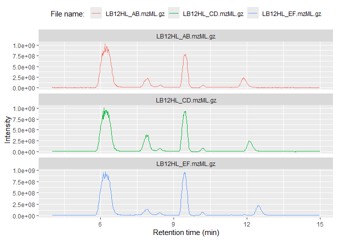

R-based access to Mass-Spec data (RaMS)
================

<!-- README.md is generated from README.Rmd. Please edit that file -->
<!-- badges: start -->

[](https://github.com/wkumler/RaMS/actions/)
[](https://codecov.io/gh/wkumler/RaMS)
<!-- badges: end -->

**Table of contents:**
[Overview](https://github.com/wkumler/RaMS#overview) -
[Installation](https://github.com/wkumler/RaMS#installation) -
[Usage](https://github.com/wkumler/RaMS#usage) - [File
types](https://github.com/wkumler/RaMS#file-types) -
[Contact](https://github.com/wkumler/RaMS#contact)

## Overview

`RaMS` is a lightweight package that provides rapid and tidy access to
mass-spectrometry data. This package is *lightweight* because it’s built
from the ground up rather than relying on an extensive network of
external libraries. No Rcpp, no Bioconductor, no long load times and
strange startup warnings. Just XML parsing provided by `xml2` and data
handling provided by `data.table`. Access is *rapid* because an absolute
minimum of data processing occurs. Unlike other packages, `RaMS` makes
no assumptions about what you’d like to do with the data and is simply
providing access to the encoded information in an intuitive and
R-friendly way. Finally, the access is *tidy* in the philosophy of [tidy
data](https://r4ds.had.co.nz/tidy-data.html). Tidy data neatly resolves
the ragged arrays that mass spectrometers produce and plays nicely with
other [tidy data packages](https://www.tidyverse.org/).


## Installation

To install the stable version on CRAN:

``` r
install.packages('RaMS')
```

To install the current development version:

``` r
devtools::install_github("wkumler/RaMS")
```

Finally, load RaMS like every other package:

``` r
library(RaMS)
```

## Usage

There’s only one main function in `RaMS`: the aptly named `grabMSdata`.
This function accepts the names of mass-spectrometry files as well as
the data you’d like to extract (e.g. MS1, MS2, BPC, etc.) and produces a
list of data tables. Each table is intuitively named within the list and
formatted tidily:

``` r
msdata_dir <- system.file("extdata", package = "RaMS")
msdata_files <- list.files(msdata_dir, pattern = "mzML", full.names=TRUE)

msdata <- grabMSdata(files = msdata_files[2:4], grab_what = c("BPC", "MS1"))
```

#### BPC/TIC data:

Base peak chromatograms (BPCs) and total ion chromatograms (TICs) have
three columns, making them super-simple to plot with either base R or
the popular [ggplot2](https://cran.r-project.org/package=ggplot2)
library:

``` r
knitr::kable(head(msdata$BPC, 3))
```

|       rt |      int | filename          |
|---------:|---------:|:------------------|
| 4.009000 | 11141859 | LB12HL_AB.mzML.gz |
| 4.024533 |  9982309 | LB12HL_AB.mzML.gz |
| 4.040133 | 10653922 | LB12HL_AB.mzML.gz |

``` r
plot(msdata$BPC$rt, msdata$BPC$int, type = "l")
```

<!-- -->

``` r
library(ggplot2)
ggplot(msdata$BPC) + geom_line(aes(x = rt, y=int, color=filename)) +
  facet_wrap(~filename, scales = "free_y", ncol = 1) +
  labs(x="Retention time (min)", y="Intensity", color="File name: ") +
  theme(legend.position="top")
```

<!-- -->

#### MS1 data:

MS<sup>1</sup> data includes an additional dimension, the *m/z* of each
ion measured, and has multiple entries per retention time:

``` r
knitr::kable(head(msdata$MS1, 3))
```

|    rt |       mz |        int | filename          |
|------:|---------:|-----------:|:------------------|
| 4.009 | 139.0503 | 1800550.12 | LB12HL_AB.mzML.gz |
| 4.009 | 148.0967 |  206310.81 | LB12HL_AB.mzML.gz |
| 4.009 | 136.0618 |   71907.15 | LB12HL_AB.mzML.gz |

This tidy format means that it plays nicely with other tidy data
packages. Here, we use \[data.table\] and a few other tidyverse packages
to compare a molecule’s <sup>13</sup>C and <sup>15</sup>N peak areas to
that of the base peak, giving us some clue as to its molecular formula.

``` r
library(data.table)
library(tidyverse)

M <- 118.0865
M_13C <- M + 1.003355
M_15N <- M + 0.997035

iso_data <- imap_dfr(lst(M, M_13C, M_15N), function(mass, isotope){
  peak_data <- msdata$MS1[mz%between%pmppm(mass) & rt%between%c(7.6, 8.2)]
  cbind(peak_data, isotope)
})

iso_data %>%
  group_by(filename, isotope) %>%
  summarise(area=sum(int)) %>%
  pivot_wider(names_from = isotope, values_from = area) %>%
  mutate(ratio_13C_12C = M_13C/M) %>%
  mutate(ratio_15N_14N = M_15N/M) %>%
  select(filename, contains("ratio")) %>%
  pivot_longer(cols = contains("ratio"), names_to = "isotope") %>%
  group_by(isotope) %>%
  summarize(avg_ratio = mean(value), sd_ratio = sd(value), .groups="drop") %>%
  mutate(isotope=str_extract(isotope, "(?<=_).*(?=_)")) %>%
  knitr::kable()
```

| isotope | avg_ratio |  sd_ratio |
|:--------|----------:|----------:|
| 13C     | 0.0543929 | 0.0006015 |
| 15N     | 0.0033375 | 0.0001846 |

With [natural
abundances](https://en.wikipedia.org/wiki/Natural_abundance) for
<sup>13</sup>C and <sup>15</sup>N of 1.11% and 0.36%, respectively, we
can conclude that this molecule likely has five carbons and a single
nitrogen.

Of course, it’s always a good idea to plot the peaks and perform a
manual check of data quality:

``` r
ggplot(iso_data) +
  geom_line(aes(x=rt, y=int, color=filename)) +
  facet_wrap(~isotope, scales = "free_y", ncol = 1)
```

<!-- -->

#### MS2 data:

DDA (fragmentation) data can also be extracted, allowing rapid and
intuitive searches for fragments or neutral losses:

``` r
msdata <- grabMSdata(files = msdata_files[1], grab_what = "MS2")
```

For example, we may be interested in the major fragments of a specific
molecule:

``` r
msdata$MS2[premz%between%pmppm(118.0865) & int>mean(int)] %>%
  plot(int~fragmz, type="h", data=., ylab="Intensity", xlab="Fragment m/z")
```

<!-- -->

Or want to search for a specific neutral loss:

``` r
msdata$MS2[, neutral_loss:=premz-fragmz] %>%
  filter(neutral_loss%between%pmppm(60.02064, 5)) %>%
  head() %>% knitr::kable()
```

|       rt |    premz |   fragmz |        int | voltage | filename         | neutral_loss |
|---------:|---------:|---------:|-----------:|--------:|:-----------------|-------------:|
| 4.182333 | 118.0864 | 58.06590 | 390179.500 |      35 | DDApos_2.mzML.gz |     60.02055 |
| 4.276100 | 116.0709 | 56.05036 |   1093.988 |      35 | DDApos_2.mzML.gz |     60.02050 |
| 4.521367 | 118.0864 | 58.06589 | 343084.000 |      35 | DDApos_2.mzML.gz |     60.02056 |
| 4.857983 | 118.0865 | 58.06590 | 314075.312 |      35 | DDApos_2.mzML.gz |     60.02057 |
| 5.195617 | 118.0865 | 58.06590 | 282611.688 |      35 | DDApos_2.mzML.gz |     60.02057 |
| 5.536383 | 118.0865 | 58.06592 | 300432.906 |      35 | DDApos_2.mzML.gz |     60.02060 |

#### Minifying MS files

As of version 1.1.0, `RaMS` also has functions that allow irrelevant
data to be removed from the file to reduce file sizes. Like
`grabMSdata`, there’s one wrapper function `minifyMSdata` that accepts
mzML or mzXML files, plus a vector of *m/z* values that should either be
kept (`mz_include`) or removed (`mz_exclude`). The function then opens
up the provided MS files and removes data points in the MS1 and MS2
spectra that fall outside the accepted bounds. `mz_include` is useful
when only a few masses are of interest, as in targeted metabolomics.
`mz_exclude` is useful when many masses are known to be contaminants or
interfere with peakpicking/plotting abilities. This minification can
sometimes shrink a file up to an order of magnitude, decreasing both
processing time and memory allocation later in the pipeline.

This is also very useful for creating demo MS files - `RaMS` uses these
functions to produce the sample data in `extdata`, with 6 MS files
taking up less than 5 megabytes of disk space. Many other programs
provide the ability to shrink files, but none (that are known) shrink
files by excluding *m/z* values and instead can only remove certain
retention times.

Below, we begin with a large MS file and extract only the data
corresponding to valine and homarine.

``` r
initial_filename <- msdata_files[1]
output_filename <- tempfile(fileext = "mzML")

masses_of_interest <- c(118.0865, 138.0555)
minifyMSdata(files = initial_filename, output_files = output_filename, 
             mz_include = masses_of_interest, ppm = 5, warn = FALSE)
```

    ## Total time: 2.67 secs

Then, when we open the file up (with `RaMS` or other software) we are
left with the data corresponding only to those compounds:

``` r
msdata <- grabMSdata(output_filename)
```

    ## 
    ## Reading file file2ea45d3b1fb6mzML... 0.26 secs 
    ## Reading MS1 data...0.24 secs 
    ## Reading MS2 data...0.06 secs 
    ## Reading BPC...0.15 secs 
    ## Reading TIC...0.15 secs 
    ## Reading file metadata...0.11 secs 
    ## Total time: 0.96 secs

``` r
knitr::kable(head(msdata$MS1, 3))
```

|      rt |       mz |        int | filename             |
|--------:|---------:|-----------:|:---------------------|
| 4.00085 | 118.0865 | 15968431.0 | file2ea45d3b1fb6mzML |
| 4.00085 | 138.0550 |   174591.6 | file2ea45d3b1fb6mzML |
| 4.00085 | 138.0550 |   174591.6 | file2ea45d3b1fb6mzML |

``` r
knitr::kable(head(msdata$MS2, 3))
```

|       rt |    premz |   fragmz |        int | voltage | filename             |
|---------:|---------:|---------:|-----------:|--------:|:---------------------|
| 4.182333 | 118.0864 | 51.81098 |   3809.649 |      35 | file2ea45d3b1fb6mzML |
| 4.182333 | 118.0864 | 58.06422 |  10133.438 |      35 | file2ea45d3b1fb6mzML |
| 4.182333 | 118.0864 | 58.06590 | 390179.500 |      35 | file2ea45d3b1fb6mzML |

``` r
unlink(output_filename)
```

These new files are valid according to the validator provided in
MSnbase, which means that most programs should be able to open them, but
this feature is still experimental and may break on quirky data.

## File types

RaMS is currently limited to the modern **mzML** data format and the
slightly older **mzXML** format. Tools to convert data from other
formats are available through
[Proteowizard](http://proteowizard.sourceforge.net/tools.shtml)’s
`msconvert` tool. Data can, however, be gzip compressed (file ending
.gz) and this compression actually speeds up data retrieval
significantly as well as reducing file sizes.

Currently, `RaMS` also handles only MS<sup>1</sup> and MS<sup>2</sup>
data. This should be easy enough to expand in the future, but right now
I haven’t observed a demonstrated need for higher fragmentation level
data collection.

Additionally, note that files can be streamed from the internet directly
if a URL is provided to `grabMSdata`, although this will usually take
longer than reading a file from disk:

``` r
## Not run:
# Find a file with a web browser:
browseURL("https://www.ebi.ac.uk/metabolights/MTBLS703/files")

# Copy link address by right-clicking "download" button:
sample_url <- paste0("https://www.ebi.ac.uk/metabolights/ws/studies/MTBLS703/",
                     "download/acefcd61-a634-4f35-9c3c-c572ade5acf3?file=",
                     "161024_Smp_LB12HL_AB_pos.mzXML")
msdata <- grabMSdata(sample_url, grab_what="everything", verbosity=2)
msdata$metadata
```

## Contact

Feel free to submit questions, bugs, or feature requests on the [GitHub
Issues page](https://github.com/wkumler/RaMS/issues).

------------------------------------------------------------------------

README last built on 2021-10-22
