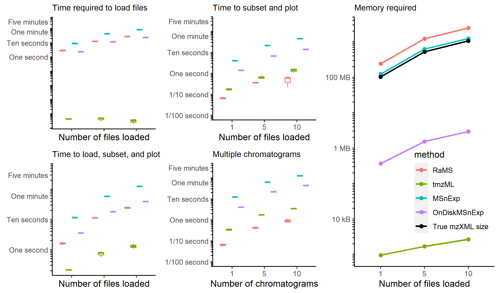

<!-- This vignette.md is generated from an .Rmd file. Please edit that file instead -->

```{r setup, include = FALSE}
options(rmarkdown.html_vignette.check_title = FALSE)
options(tidyverse.quiet = TRUE)
data.table::setDTthreads(2)

knitr::opts_chunk$set(
  collapse = TRUE,
  comment = "#>",
  out.width = "80%",
  fig.align = 'center',
  fig.height = 3,
  fig.width = 6.5
)
```

**Warning:**

This vignette deals with a feature still undergoing active development. While I
can't promise to update it immediately with changes, I will do my best to keep
you in the loop as this functionality evolves. Please also see the [speed & size comparison vignette](https://cran.r-project.org/web/packages/RaMS/vignettes/speed_size_comparison.html) for more stable alternatives.

**Table of contents:**

* [What is tmzML?]
* [Why tmzML?]
* [Getting started with tmzML documents]
* [Why not tmzML?]
* [tmzML internals]

## What is tmzML?

A tmzML document is a new type of mass-spectrometry file that's optimized for
EIC extraction and visualization. These were introduced in version 1.2.0 of
RaMS and aren't used anywhere else. Internally, they're just XML documents
with the same MS data in the mzML file they're created from, but the 
organization means that accessing data by *m/z* value is much faster and 
requires far less memory.

The name stands for "transposed mzML" and is inspired by the idea that mzML
documents are organized by scan number. This makes sense given that the
original MS data was produced one scan at a time, but this format also makes
EIC extraction from the original files slower because there's no indexing by 
*m/z*. What RaMS does here is "transposes" the original document so that
data are grouped by *m/z* value instead of scan. This means that to extract
a chromatogram, only a small portion of the file needs to be read instead of
the whole thing.

## Why tmzML?

RaMS is great because it supplies rapid, intuitive access to mzML documents.
However, this access comes at a cost - the entire file needs to be loaded into
R's memory simultaneously. Given that MS files can easily be tens or hundreds
of megabytes in size, this limits the number of files that can be open at once
to the computer memory available.

With tmzMLs, much of the "hard" work is done in advance by reorganizing the
structure of the file on disk. This allows us to read only the essential data
into memory, vastly improving initial read time and enormously reducing the
amount of memory required. This makes it possible to open hundreds or even
thousands of tmzML documents simultaneously and extract a chromatogram
from each one of them, all on a basic laptop. Within a minute. Below are some
benchmarking tests comparing the new tmzML file type to the traditional RaMS
code and MSnbase's MSnExp and OnDiskMSnExp.

{width=100%}

The tmzML documents take essentially no time to load and require barely
kilobytes of memory. This is because we aren't doing any data handling yet -
we're just creating an R object that points to our files and manages the
provided parameters elegantly. When we actually request the data, the tmzML
file is opened, scanned, and read into memory. This is a little slower than
requesting the data the traditional way because data from mzML files read into
RaMS is already stored in memory, but it still takes fractions of a second and
is an order of magnitude faster than the MSnbase functions.

To the user, the end result is almost identical: a list of `data.table`s named
by what the user requested (MS1, MS2, BPC, EIC, etc.) in tidy format. This means
all your favorite tidyverse tricks and the code you've written to handle the
old RaMS output will work identically. However,
the full data file is never read into memory so there are some quirks that I 
discuss [below](#why-not-tmzml).

## Getting started with tmzML documents

First, mzML/mzXML documents must be converted to tmzML. Again, these files
might feel similar but they're very different internally. We'll use a couple
of the files packaged with RaMS and convert them in a temporary directory.

```{r listfiles}
files_to_convert <- list.files(
  system.file("extdata", package = "RaMS"), full.names = TRUE, pattern = "mzML"
)[2:4]
```

The function `tmzmlMaker` is the workhorse here. It's not vectorized, so you'll
need to loop over multiple files if you've got them. And while it has some
basic renaming logic internally, it's safest to pass a list of output filenames
(just remember to end them with file type .tmzML!). My usual project setup
has a folder for the mzML files of the project, so creating a similar tmzML
folder has worked well for me.

```{r maketmzmls}
library(RaMS)
# Create a folder to hold the new files
dir.create("tmzMLs")

# Convert a single file
file_to_create <- "tmzMLs/LB12HL_AB.tmzML"
tmzmlMaker(input_filename = files_to_convert[1], output_filename = file_to_create)

# Convert multiple files
files_to_create <- paste0("tmzMLs/", basename(files_to_convert))
# Make sure they end in .tmzML!
files_to_create <- gsub(x = files_to_create, "\\.mzML.*", ".tmzML")
# Loop over each file input/output pair
created_files <- mapply(tmzmlMaker, files_to_convert, files_to_create)
```

These files should now exist in the folder and can be opened with Notepad or
a similar word processer if you're curious, but they're mostly encoded so it
may not be incredibly informative.

Extracting a chromatogram from a tmzML document should feel very familiar to
anyone already used to using RaMS. `grabMSdata` is smart enough to realize
that it's dealing with .tmzML files instead of .mzML files from the filename,
so you can reuse the exact same function as before. However, unlike when
loading mzMLs this step should be instantaneous.

```{r grabmsdata}
msdata <- grabMSdata(created_files, verbosity=0)
```

If you're planning to extract a chromatogram, the syntax is identical to 
traditional RaMS:

```{r subset$}
ms_data_table <- msdata$MS1[mz%between%pmppm(152.05723, 5)]
```

Which is a perfectly normal `data.table` object ready to be passed to more 
familiar functions:

```{r ggplot, fig.width=8, warning=FALSE}
library(ggplot2)
ggplot(ms_data_table) + geom_line(aes(x=rt, y=int, color=filename)) + xlim(8, 9.5)
```

```{r dplyr}
library(dplyr)
ms_data_table %>%
  filter(rt%between%c(8.4, 8.9)) %>%
  group_by(filename) %>%
  summarise(area=sum(int))
```

## Why not tmzML?

However, there are some quirks to the tmzML object itself. If you're used to
inspecting the initial RaMS output by printing it to the console, you'll get
a new message instead of the expected list of data tables:

```{r print msdata_connection}
print(msdata)
```

This is because the `msdata` object in this case isn't a list anymore - it's a
custom object that really only contains the names of the files and the settings
you initially provided to `grabMSdata`. You can see this with `str()`:

```{r str msdata_connection}
str(msdata)
```

Eagle-eyed browsers may have already noticed that the `msdata` object is a 
little different than before because there's this new `connection` option that
shows up when tab-completing the extraction code above. The MS1 and MS2 objects
here will actually always be NULL - I just added them so that tab-completion
will remind you what things you can ask `msdata` for via `$` notation. If you
see the message above, it means that you've asked a tmzML for something that
you should ask with traditional RaMS instead because it's outside the scope of
the tmzML optimization.

The `$` and `[` syntax provided above is really the only thing that will work
with tmzMLs. Any request that's meant to operate on the data as a whole
will fail and subsetting with head() or tail() won't work either. Also,
subsetting based on retention time needs to be done separately because these
poor files have been indexed within an inch of their lives for a single purpose.

```{r expected errors, error=TRUE}
# Cannot order data by mass
msdata$MS1[-mz]
# Cannot request the top few rows
msdata[1:10,]
# Cannot subset by retention time
msdata$MS1[rt %between% c(8, 9.5)]
```

In general, if you get an error mentioning the `msdata_connection` object you
should probably be using traditional RaMS on mzMLs instead of the new tmzMLs.

## tmzML internals

If you haven't yet played with tmzMLs already, please consider doing so now. The
remainder of this is really geared towards useRs who have already seen what
tmzMLs do and are interested in some of the magic behind it.

RaMS works on tmzMLs by defining a new S3 object class, the `msdata_connection`.
This allowed me to define new behavior for `$` and `[` so that the syntax is
identical to the traditional RaMS arrangement but requires some complicated
internal mapping. The `$` remapping that occurs can be viewed with `r cat("RaMS:::\x60$.msdata_connection\x60")` but is really just a basic way to
pass a single MS level at a time to the `[` function. The `[` function, on the other
hand, is really where the magic happens. You can view the source code again with
`r cat("RaMS:::\x60[.msdata_connection\x60")` but what basically happens is that
we manually parse the subset function using `substitute` and `eval.parent`,
finally open up the file, and access only those XML nodes that have *m/z*
values of interest. This returns a data table containing all the *m/z* values
in a large bin (defaulting to 3 Da) that's then subset further down to just the
requested values.

I'm still deciding whether XML documents are the way to go. Having it be XML
means that I can expand it effortlessly and essentially future-proofs it for
additional functionality that I'd like to add later, but does require that the
whole file is read in at a high level. Something simpler like a pure-text
document could have a header that's read in separately from the rest of the
document that then contains pointers to the data. Preliminary tests suggest
this plain-text method is 5-10 times faster than the XML style but tmzMLs are
already plenty fast so we may be approaching diminishing returns.

```{r cleanup}
unlink("tmzMLs", recursive = TRUE)
```

***

Vignette last built on `r Sys.Date()`
