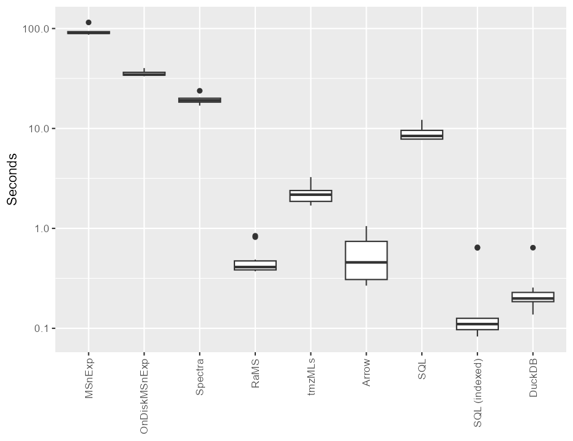
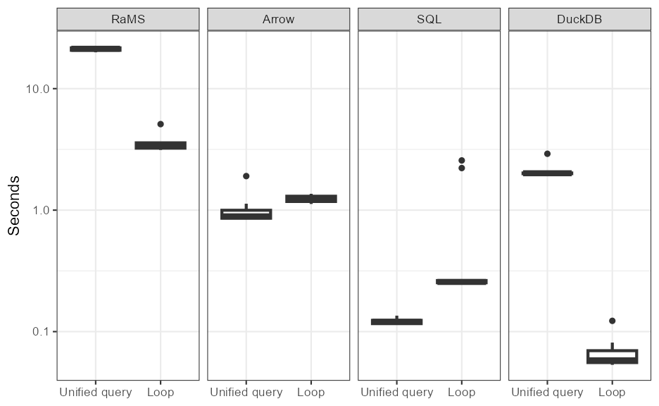
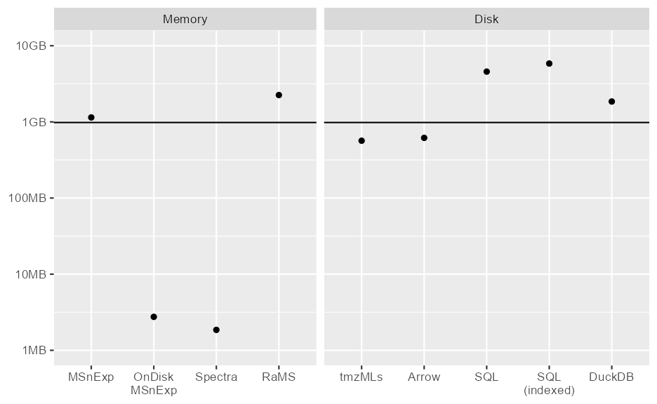
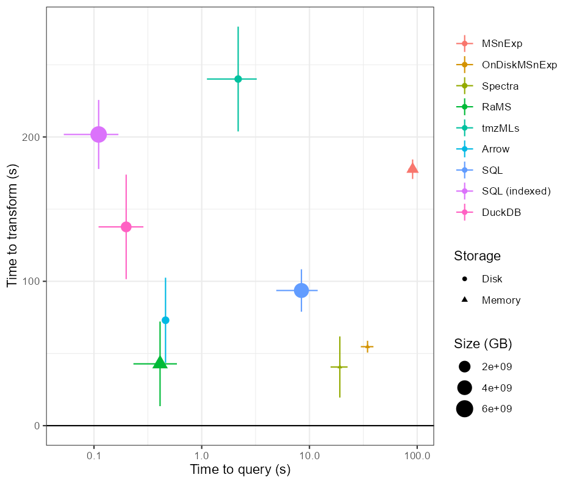

```{r setup, include=FALSE}
knitr::opts_chunk$set(echo = TRUE, eval=FALSE)
options(rmarkdown.html_vignette.check_title = FALSE)
data.table::setDTthreads(2)
```

```{r}
library(RaMS)
library(tidyverse)
library(microbenchmark)
library(MSnbase)
library(Spectra)
library(DBI)
library(arrow)
library(rvest)
library(xml2)

BiocParallel::register(BiocParallel::SerialParam(stop.on.error = FALSE, progressbar = TRUE))
```

```{r file download}
set.seed(123)

n_ms_files <- 10
base_url <- "ftp://massive.ucsd.edu/v01/MSV000080030/peak/" %>%
  paste0("Forensic_study_80_volunteers/Forensic_Hands_mzXML/") %>% 
  paste0("Forensic_Hands_plate_1_mzXML/Sample/")
file_list <- base_url %>%
  read_html %>%
  xml_text() %>%
  strsplit("\\\n") %>%
  pluck(1) %>%
  str_remove(".*2016 ") %>%
  str_remove("\\\r")
chosen_file_list <- sample(file_list, n_ms_files)

dir.create("vignettes/figures/ssc_vignette_renders/Sample/")
for(i in chosen_file_list){
  new_file_path <- paste0("vignettes/figures/ssc_vignette_renders/Sample/", i)
  download.file(paste0(base_url, i), destfile = new_file_path, mode = "wb")
}

ms_files <- list.files("vignettes/figures/ssc_vignette_renders/Sample/", full.names = TRUE)
```

## Intro

As noted in the [RaMS and friends vignette](https://cran.r-project.org/package=RaMS/vignettes/Minifying-files-with-RaMS.html), one of the major strengths of the 'tidy' data format is how nicely it plays with other packages, allowing for the use of powerful packages that can't normally be applied to MS data. After playing with a few different ones I wanted to do some structured benchmarking to see which is the best use case for various situations.

The general constraints I'm interested in are speed and space, with a minor consideration for simplicity afterward. My question of interest is how costly in these areas access to the MS data is, a process that can be broken down into two relevant steps - the transformation of the MS data from mz(X)ML format into a queryable format, and then the actual query itself. The query itself is relatively straightforward and can be measured in just the amount of time it takes, but the transformation has a caveat that it can be stored either in memory (and therefore must be recreated every time R is restarted) or it can be stored on disk (which is robust across restarts). So I'm interested in

1. Time to create
2. Size in memory/size on disk
3. Time to access

I'll be measuring these constraints across eight different ways of accessing the MS data.

#### Original MSnExp

Not used much these days since there's a big push to XCMS3 and the new "on-disk" infrastructure but still provides a useful baseline. The object is stored in memory and is 10/10 in simplicity.

```{r MSnExp}
msnexp_obj <- readMSData(ms_files, mode="inMemory", msLevel. = 1)
plot(chromatogram(msnexp_obj, mz=pmppm(432.2810, ppm = 20)))
```

#### New onDiskMSnExp infrastructure

The newest version of an XCMS object, using a system of pointers to reduce memory load. The object itself is still stored in memory but is equally easy to construct.

```{r onDiskMSnExp}
ondisk_obj <- readMSData(ms_files, mode="onDisk", msLevel. = 1)
plot(chromatogram(ondisk_obj, mz=pmppm(432.2810, ppm = 20)))
```

#### Spectra package

The Spectra package "defines an efficient infrastructure for storing and handling mass spectrometry spectra and functionality to subset, process, visualize and compare spectra data." It doesn't handle chromatograms very well but is a useful benchmark for next-gen read and write times. For benchmarking comparisons to other data sets, see the [vignette in the Spectra package](https://bioconductor.org/packages/release/bioc/vignettes/MsBackendSql/inst/doc/MsBackendSql.html#4_Performance_comparison_with_other_backends).

```{r Spectra}
getIntensities <- function(x, ...) {
  if (nrow(x)) {
    cbind(mz = NA_real_, intensity = x[, "intensity"])
  } else cbind(mz = NA_real_, intensity = NA_real_)
}

sfs_filtered <- Spectra(ms_files, source=MsBackendMzR()) %>%
  filterMsLevel(1) %>%
  filterMzRange(pmppm(432.2810, ppm = 20))
sfs_agg <- addProcessing(sfs_filtered, getIntensities)
eic <- cbind(rt=rtime(sfs_agg), int=unlist(intensity(sfs_agg), use.names = FALSE))
plot(eic[,"rt"], eic[,"int"], type="l")
```

#### RaMS package

The eponymous package, notoriously heavy on memory but very speedy and still pretty darn simple.

```{r RaMS}
rams_obj <- grabMSdata(ms_files, grab_what="MS1")
rams_chrom_data <- rams_obj$MS1[mz%between%pmppm(432.2810, ppm = 20)]
plot(rams_chrom_data$rt, rams_chrom_data$int, type="l")
```

#### tmzML files

I designed the tmzMLs to be a "transposed" mzML where data are stored as binned chromatograms rather than individual scans, thus making it much more efficient to extract the data with a minimal memory requirement. This was before I was more familiar with formats like Parquet and SQL though.

```{r tmzML}
tmzml_names <- paste0(dirname(dirname(ms_files)), "/tmzMLs/", gsub("mzXML", "tmzML", basename(ms_files)))
dir.create("vignettes/figures/ssc_vignette_renders/tmzMLs")
bpmapply(tmzmlMaker, ms_files, tmzml_names, BPPARAM = SnowParam(workers = 3, progressbar = TRUE, tasks=length(tmzml_names)))
tmzml_obj <- grabMSdata(tmzml_names)
tmzml_chrom_data <- tmzml_obj$MS1[mz%between%pmppm(432.2810, ppm = 20)]
plot(tmzml_chrom_data$rt, tmzml_chrom_data$int, type="l")
```

#### Arrow package

Apache's arrow package is designed to interface with parquet files, a column-based instead of row-based file type, with fast access to large datasets with a minimal memory footprint. There's an excellent package that allows seamless interfacing with R and makes reading and writing files almost trivial. This package was the one that actually made me originally want to write about this because it outperformed tmzMLs and other databases so overwhelmingly.

```{r arrow}
write_dataset(rams_obj$MS1[order(mz)], path = "vignettes/figures/ssc_vignette_renders/pqds")
arrow_data <- open_dataset("vignettes/figures/ssc_vignette_renders/pqds") %>%
  filter(mz%between%pmppm(432.2810, ppm = 20)) %>%
  dplyr::collect()
plot(arrow_data$rt, arrow_data$int, type="l")
```

#### SQL(ite)

Finally, another important baseline is SQL databases. In theory these are the "proper" way to store large amounts of MS data but I haven't found them to be incredibly efficient previously, both slow to query and very large on disk. Here I'm testing both the default SQL database as well as one indexed by m/z to optimize for chromatogram extraction.

```{r sqlite database}
MSdb <- dbConnect(RSQLite::SQLite(), "vignettes/figures/ssc_vignette_renders/MSdata.sqlite")
dbWriteTable(MSdb, "MS1", rams_obj$MS1, overwrite=TRUE)
EIC_query <- 'SELECT * FROM MS1 WHERE mz BETWEEN :lower_bound AND :upper_bound'
query_params <- as.list(pmppm(432.2810, ppm = 20))
names(query_params) <- c("lower_bound", "upper_bound")
sql_data <- dbGetQuery(MSdb, EIC_query, params = query_params)
plot(sql_data$rt, sql_data$int, type="l")

dbClearResult(dbSendQuery(MSdb, "CREATE INDEX mz ON MS1 (mz)"))
sql_data <- dbGetQuery(MSdb, EIC_query, params = query_params)
sql_data <- sql_data[order(sql_data$filename, sql_data$rt),]
plot(sql_data$rt, sql_data$int, type="l")
dbDisconnect(MSdb)
```

#### DuckDB

DuckDB is basically a SQLite database on steroids. Same kind of single-file structure designed for OLAP but cleverly uses row groups and other optimization tricks to get some pretty impressive returns. Organizing them by mz is important (as it is with Parquet files) so that their indexing is useful.

```{r}
msduck <- dbConnect(duckdb::duckdb(), "vignettes/figures/ssc_vignette_renders/duckdb")
dbWriteTable(msduck, "MS1", rams_obj$MS1[order(mz)], overwrite=TRUE)

EIC_query <- paste('SELECT * FROM MS1 WHERE mz BETWEEN', pmppm(432.2810, ppm = 20)[1], 
                   'AND', pmppm(432.2810, ppm = 20)[2])
duck_data <- dbGetQuery(msduck, EIC_query)
duck_data <- duck_data[order(duck_data$filename, duck_data$rt),]
plot(duck_data$rt, duck_data$int, type="l")
dbDisconnect(msduck)
```


## MS data transformation timings

Below, I've pulled out the "transformation" step from each of the eight methods above that gets the MS data out of the mzML documents and into an R-readable structure. For the first four (MSnExp, onDiskMSnExp, Spectra, and RaMS) this creates an object in the R environment that is wiped each time R is restarted, so they must be recreated every time. For the last four, files are created on the hard drive that are robust across R sessions and only need to be created once.

```{r time2make}
msnexp_make_fun <- function(){
  readMSData(ms_files, mode="inMemory", msLevel. = 1)
}
ondisk_make_fun <- function(){
  readMSData(ms_files, mode="onDisk", msLevel. = 1)
}
spectra_make_fun <- function(){
  Spectra(ms_files, source=MsBackendMzR()) %>% filterMsLevel(1)
}
rams_make_fun <- function(){
  grabMSdata(ms_files, grab_what="MS1")
}
tmzml_make_fun <- function(){
  tmzml_names <- paste0(dirname(dirname(ms_files)), "/tmzMLs/", 
                        gsub("mzXML", "tmzML", basename(ms_files)))
  dir.create("vignettes/figures/ssc_vignette_renders/tmzMLs")
  mapply(tmzmlMaker, ms_files, tmzml_names)
  unlink("vignettes/figures/ssc_vignette_renders/tmzMLs", recursive = TRUE)
}
arrow_make_fun <- function(){
  msdata <- grabMSdata(ms_files, grab_what="MS1")
  write_dataset(msdata$MS1, path = "vignettes/figures/ssc_vignette_renders/pqds")
  unlink("vignettes/figures/ssc_vignette_renders/pqds", recursive = TRUE)
}
sql_make_fun <- function(){
  msdata <- grabMSdata(ms_files, grab_what="MS1")
  MSdb <- dbConnect(RSQLite::SQLite(), "vignettes/figures/ssc_vignette_renders/MSdata.sqlite")
  dbWriteTable(MSdb, "MS1", msdata$MS1, overwrite=TRUE)
  dbDisconnect(MSdb)
  unlink("vignettes/figures/ssc_vignette_renders/MSdata.sqlite")
}
sqlidx_make_fun <- function(){
  msdata <- grabMSdata(ms_files, grab_what="MS1")
  MSdb_idx <- dbConnect(RSQLite::SQLite(), "vignettes/figures/ssc_vignette_renders/MSdata_idx.sqlite")
  dbWriteTable(MSdb_idx, "MS1", msdata$MS1, overwrite=TRUE)
  rs <- dbSendQuery(MSdb_idx, "CREATE INDEX mz ON MS1 (mz)")
  dbClearResult(rs)
  dbDisconnect(MSdb_idx)
  unlink("vignettes/figures/ssc_vignette_renders/MSdata_idx.sqlite")
}
duckdb_make_fun <- function(){
  msdata <- grabMSdata(ms_files, grab_what="MS1")
  msduck <- dbConnect(duckdb::duckdb(), "vignettes/figures/ssc_vignette_renders/duckdb")
  dbWriteTable(msduck, "MS1", rams_obj$MS1[order(mz)], overwrite=TRUE)
  dbDisconnect(msduck)
  unlink("vignettes/figures/ssc_vignette_renders/duckdb")
}

make_timings <- microbenchmark(
  msnexp_make_fun(), ondisk_make_fun(), spectra_make_fun(), rams_make_fun(),
  tmzml_make_fun(), arrow_make_fun(), sql_make_fun(), sqlidx_make_fun(), 
  duckdb_make_fun(),
  times = 10)
write_csv(make_timings, "vignettes/figures/ssc_vignette_renders/make_timings.csv")
```

```{r plot time2make}
make_timings <- read_csv("vignettes/figures/ssc_vignette_renders/make_timings.csv")
make_timings %>%
  as.data.frame() %>%
  arrange(expr) %>%
  mutate(expr=str_remove(expr, "_make_fun\\(\\)")) %>%
  mutate(rep_type=case_when(
    expr%in%c("msnexp", "ondisk", "spectra", "rams")~"Every R session",
    TRUE~"Single-time only"
  )) %>%
  mutate(expr=factor(expr, levels=c("msnexp", "ondisk", "spectra", "rams",
                                    "tmzml", "arrow", "sql", "sqlidx", "duckdb"),
                     labels=c("MSnExp", "OnDiskMSnExp", "Spectra", "RaMS",
                              "tmzMLs", "Arrow", "SQL", "SQL (indexed)", "DuckDB"))) %>%
  ggplot() + 
  geom_boxplot(aes(x=expr, y=time/1e9)) +
  geom_hline(yintercept = 0) +
  facet_wrap(~rep_type, nrow = 1, scales="free_x") +
  labs(y="Seconds", x=NULL) +
  theme(axis.text.x = element_text(angle=90, hjust=1, vjust=0.5))
ggsave("vignettes/figures/ssc_vignette_renders/make_time_gp.png", width = 6.5, height = 4, units = "in", device = "png", dpi = 144)
```

{width=100%}

Nothing super surprising here. It should be noted that I ran all of these without using parallel processing to ensure a fair comparison, but RaMS and the tmzMLs are almost perfectly parallelizable and can be read/written in series for a huge time saving. Testing this with 5 cores across the 10 files resulted in a 3-fold speed improvement (from ~250 seconds to ~85, placing it about on par with the SQL database) for tmzMLs but not for default RaMS. This makes sense if I/O is the slow step but reading can be done separately from writing, thus preventing multiple simultaneous reads but allowing one tmzML to be written while another is read. Also worth noting is that because `tmzmlMaker` calls `grabMSdata` internally, the RaMS values are a lower bound on the maximum tmzML speed. The MSnExp, OnDiskMSnExp, and Spectra packages focus instead on parallelizing their query step and I can't seem to run those in parallel. The SQL and Arrow options similarly write to a single file that's presumably going to be "locked" during writing and don't have parallelization options available either. Also worth noting is that performing this test on 10 files (~1GB MS data) doesn't really challenge memory requirements, so this could be very different if a larger number of files was used.

```{r parallel_proc}
unpar_rams <- function(){
  print("Unpar RaMS")
  lapply(ms_files, grabMSdata)
}
unpar_tmzml <- function(){
  print("Unpar tmzML")
  tmzml_names <- paste0(dirname(dirname(ms_files)), "/tmzMLs/", 
                        gsub("mzXML", "tmzML", basename(ms_files)))
  dir.create("vignettes/figures/ssc_vignette_renders/tmzMLs")
  pbapply::pbmapply(tmzmlMaker, ms_files, tmzml_names)
  unlink("vignettes/figures/ssc_vignette_renders/tmzMLs", recursive = TRUE)
}

library(BiocParallel)
par_param <- SnowParam(workers = 5, progressbar = TRUE)
par_rams <- function(){
  print("Par RaMS")
  bplapply(ms_files, grabMSdata, BPPARAM = par_param)
}
par_tmzml <- function(){
  print("Par tmzML")
  tmzml_names <- paste0(dirname(dirname(ms_files)), "/tmzMLs/", 
                        gsub("mzXML", "tmzML", basename(ms_files)))
  dir.create("vignettes/figures/ssc_vignette_renders/tmzMLs")
  bpmapply(tmzmlMaker, ms_files, tmzml_names, BPPARAM = par_param)
  unlink("vignettes/figures/ssc_vignette_renders/tmzMLs", recursive = TRUE)
}

par_timings <- microbenchmark(par_rams(), unpar_rams(), par_tmzml(), unpar_tmzml(), times = 5)
write_csv(par_timings, "vignettes/figures/ssc_vignette_renders/par_timings.csv")
```

```{r parallel proc plot}
par_timings <- read_csv("vignettes/figures/ssc_vignette_renders/par_timings.csv")
par_timings %>%
  as.data.frame() %>%
  separate(expr, into = c("sub_type", "par_type"), sep = "_") %>%
  mutate(par_type=str_remove(par_type, "\\(\\)")) %>%
  mutate(sub_type=factor(sub_type, levels=c("unpar", "par"),
                         labels=c("Sequential", "Parallel"))) %>%
  mutate(par_type=factor(par_type, levels=c("rams", "tmzml"),
                         labels=c("RaMS", "tmzMLs"))) %>%
  ggplot() + 
  geom_boxplot(aes(x=par_type, y=time/1e9)) +
  geom_hline(yintercept = 0) +
  facet_wrap(~sub_type, nrow = 1) +
  labs(y="Seconds", x=NULL) +
  theme(axis.text.x = element_text(angle=90, hjust=1, vjust=0.5))
ggsave("vignettes/figures/ssc_vignette_renders/par_time_gp.png", width = 6.5, height = 3, units = "in", device = "png", dpi = 144)
```

{width=100%}

## MS data query timings

After the MS data has been transformed into an accessible format, it still needs to be queried for a single chromatogram of interest. This typically means performing a search across the ~75 million entries of mz/rt/int data for the m/z values within a certain window, and can be performed either on an object in memory (e.g. MSnExp & RaMS) or on a disk object.

```{r time2query}
msnexp_obj <- readMSData(ms_files, mode="inMemory", msLevel. = 1)
ondisk_obj <- readMSData(ms_files, mode="onDisk", msLevel. = 1)
spectra_obj <- Spectra(ms_files, source=MsBackendMzR()) %>% filterMsLevel(1)
rams_obj <- grabMSdata(ms_files, grab_what="MS1")

tmzml_names <- paste0(dirname(dirname(ms_files)), "/tmzMLs/", 
                      gsub("mzXML", "tmzML", basename(ms_files)))
dir.create("vignettes/figures/ssc_vignette_renders/tmzMLs")
mapply(tmzmlMaker, ms_files, tmzml_names)

write_dataset(rams_obj$MS1[order(mz)], path = "vignettes/figures/ssc_vignette_renders/pqds")

MSdb <- dbConnect(RSQLite::SQLite(), "vignettes/figures/ssc_vignette_renders/MSdata.sqlite")
dbWriteTable(MSdb, "MS1", rams_obj$MS1, overwrite=TRUE)
dbDisconnect(MSdb)

MSdb_idx <- dbConnect(RSQLite::SQLite(), "vignettes/figures/ssc_vignette_renders/MSdata_idx.sqlite")
dbWriteTable(MSdb_idx, "MS1", rams_obj$MS1, overwrite=TRUE)
dbClearResult(dbSendQuery(MSdb_idx, "CREATE INDEX mz ON MS1 (mz)"))
dbDisconnect(MSdb_idx)

msduck <- dbConnect(duckdb::duckdb(), "vignettes/figures/ssc_vignette_renders/duckdb")
dbWriteTable(msduck, "MS1", rams_obj$MS1[order(mz)], overwrite=TRUE)
dbDisconnect(msduck)

msnexp_query_fun <- function(){
  plot(chromatogram(msnexp_obj, mz=pmppm(432.2810, ppm = 20)))
}
ondisk_query_fun <- function(){
  plot(chromatogram(ondisk_obj, mz=pmppm(432.2810, ppm = 20)))
}
spectra_query_fun <- function(){
  sfs_filtered <- spectra_obj %>% filterMzRange(pmppm(432.2810, ppm = 20))
  getIntensities <- function(x, ...) {
    if (nrow(x)) {
      cbind(mz = NA_real_, intensity = x[, "intensity"])
    } else cbind(mz = NA_real_, intensity = NA_real_)
  }
  sfs_agg <- addProcessing(sfs_filtered, getIntensities)
  eic <- cbind(rt=rtime(sfs_agg), int=unlist(intensity(sfs_agg), use.names = FALSE))
  plot(eic[,"rt"], eic[,"int"], type="l")
}
rams_query_fun <- function(){
  rams_chrom_data <- rams_obj$MS1[mz%between%pmppm(432.2810, ppm = 20)]
  plot(rams_chrom_data$rt, rams_chrom_data$int, type="l")
}
tmzml_query_fun <- function(){
  tmzml_names <- list.files("vignettes/figures/ssc_vignette_renders/tmzMLs", full.names = TRUE)
  tmzml_obj <- grabMSdata(tmzml_names)
  tmzml_chrom_data <- tmzml_obj$MS1[mz%between%pmppm(432.2810, ppm = 20)]
  plot(tmzml_chrom_data$rt, tmzml_chrom_data$int, type="l")
}
arrow_query_fun <- function(){
  arrow_data <- open_dataset("vignettes/figures/ssc_vignette_renders/pqds") %>%
    filter(mz%between%pmppm(432.2810, ppm = 20)) %>%
    dplyr::collect()
  arrow_data <- arrow_data[order(arrow_data$filename, arrow_data$rt),]
  plot(arrow_data$rt, arrow_data$int, type="l")
}
sql_query_fun <- function(){
  MSdb <- dbConnect(RSQLite::SQLite(), "vignettes/figures/ssc_vignette_renders/MSdata.sqlite")
  EIC_query <- 'SELECT * FROM MS1 WHERE mz BETWEEN :lower_bound AND :upper_bound'
  query_params <- as.list(pmppm(432.2810, ppm = 20))
  names(query_params) <- c("lower_bound", "upper_bound")
  sql_data <- dbGetQuery(MSdb, EIC_query, params = query_params)
  plot(sql_data$rt, sql_data$int, type="l")
  dbDisconnect(MSdb)
}
sqlidx_query_fun <- function(){
  MSdb_idx <- dbConnect(RSQLite::SQLite(), "vignettes/figures/ssc_vignette_renders/MSdata_idx.sqlite")
  EIC_query <- 'SELECT * FROM MS1 WHERE mz BETWEEN :lower_bound AND :upper_bound'
  query_params <- as.list(pmppm(432.2810, ppm = 20))
  names(query_params) <- c("lower_bound", "upper_bound")
  sql_data <- dbGetQuery(MSdb_idx, EIC_query, params = query_params)
  sql_data <- sql_data[order(sql_data$filename, sql_data$rt),]
  plot(sql_data$rt, sql_data$int, type="l")
  dbDisconnect(MSdb_idx)
}
duckdb_query_fun <- function(){
  msduck <- dbConnect(duckdb::duckdb(), "vignettes/figures/ssc_vignette_renders/duckdb")
  EIC_query <- paste('SELECT * FROM MS1 WHERE mz BETWEEN', pmppm(432.2810, ppm = 20)[1], 
                   'AND', pmppm(432.2810, ppm = 20)[2])
  duck_data <- dbGetQuery(msduck, EIC_query)
  duck_data <- duck_data[order(duck_data$filename, duck_data$rt),]
  plot(duck_data$rt, duck_data$int, type="l")
  dbDisconnect(msduck)
}
# Could be optimized by doing the ordering within the query

query_timings <- microbenchmark(
  msnexp_query_fun(), ondisk_query_fun(), spectra_query_fun(), rams_query_fun(),
  tmzml_query_fun(), arrow_query_fun(), sql_query_fun(), sqlidx_query_fun(),
  duckdb_query_fun(),
  times = 10
)
query_timings
write_csv(query_timings, "vignettes/figures/ssc_vignette_renders/query_timings.csv")
```

```{r time2query plot}
query_timings <- read_csv("vignettes/figures/ssc_vignette_renders/query_timings.csv")
query_timings %>%
  as.data.frame() %>%
  arrange(expr) %>%
  mutate(expr=str_remove(expr, "_query_fun\\(\\)")) %>%
  mutate(rep_type=case_when(
    expr%in%c("msnexp", "ondisk", "spectra", "rams")~"Every R session",
    TRUE~"Single-time only"
  )) %>%
  mutate(expr=factor(expr, levels=c("msnexp", "ondisk", "spectra", "rams",
                                    "tmzml", "arrow", "sql", "sqlidx", "duckdb"),
                     labels=c("MSnExp", "OnDiskMSnExp", "Spectra", "RaMS",
                              "tmzMLs", "Arrow", "SQL", "SQL (indexed)", "DuckDB"))) %>%
  ggplot() + 
  geom_boxplot(aes(x=expr, y=time/1e9)) +
  scale_y_log10() +
  labs(y="Seconds", x=NULL) +
  theme(axis.text.x = element_text(angle=90, hjust=1, vjust=0.5))
ggsave("vignettes/figures/ssc_vignette_renders/query_time_gp.png", width = 6.5, height = 5, units = "in", device = "png", dpi = 144)
```

{width=100%}

There's a few surprises in the above plot. Most notably, the incredible speed of the mz-indexed SQLite database. It's apparently faster to query the database and read that data into R than it is to index through the big RaMS object entirely within memory. That's a pretty darn compelling reason to switch to SQL databases (although note the importance of indexing them - the non-indexed one took 100x longer!). Side note: I originally expected this to be quite slow because I previously *thought* I was creating an index on the mz data using `dbExecute` instead of `dbSendQuery` but apparently that's not how the function works. This actually disagrees with a [similar comparison](https://bioconductor.org/packages/release/bioc/vignettes/MsBackendSql/inst/doc/MsBackendSql.html#4_Performance_comparison_with_other_backends) done by the Spectra package that found the SQL backend to be consistently slower than the in-memory option. This result was so unexpected that I wrote a quick followup to double-check and can confirm that in real time the SQL query felt faster than the RaMS object. DuckDB is nearly as good as SQLite and has some other advantages discussed later.

```{r double-check sql_idx vs RaMS}
MSdb_idx <- dbConnect(RSQLite::SQLite(), "vignettes/figures/ssc_vignette_renders/MSdata_idx.sqlite")
EIC_query <- 'SELECT * FROM MS1 WHERE mz BETWEEN :lower_bound AND :upper_bound'
query_params <- as.list(pmppm(432.2810, ppm = 20))
names(query_params) <- c("lower_bound", "upper_bound")
dbGetQuery(MSdb_idx, EIC_query, params = query_params) %>% qplotMS1data()

rams_obj$MS1[mz%between%pmppm(432.2810, ppm = 20)] %>% qplotMS1data()
```

Of course, up at the top are the traditional MS formats. They're not designed for this or optimized for chromatogram extraction at all so it's not especially surprising that they struggle, but the graph does also nicely show the improved performance of more recent versions over older ones.

#### Multiple chromatograms

Of course, the above tests assume that only a single chromatogram is being requested. This is a little unrealistic. While there are times when I just want to see a single mass, I also often want to extract multiple masses of interest simultaneously and some of these methods are more friendly to this approach than others. This usually requires constructing a string of `between` statements that we can then pass to the evaluator. Fortunately, the same string can be passed to both Arrow and RaMS so that makes the task a little easier. The nice thing about sending a single query is also that the data does not then need to be deduplicated, which can happen during loops if the m/z windows overlap.

```{r make query strings}
rams_obj <- grabMSdata(ms_files, grab_what="MS1")
grouped_ms1 <- rams_obj$MS1 %>%
  arrange(desc(int)) %>% 
  mutate(mz_group=mz_group(mz, ppm = 10, max_groups = 10, min_group_size=20)) %>%
  drop_na()
# grouped_ms1 %>%
#   qplotMS1data(facet_col="mz_group", facet_args = list(ncol=2))
mzs_to_grab <- grouped_ms1 %>%
  group_by(mz_group) %>%
  summarise(mean_mz=mean(mz), sd_mz=sd(mz), mean_rt=mean(rt)) %>%
  pull(mean_mz)

rams_arrow_call <- lapply(mzs_to_grab, function(mz_i){
  mzrange <- pmppm(mz_i, 10)
  call("between", as.name("mz"), mzrange[[1]], mzrange[[2]])
}) %>% paste(collapse = "|")

sql_comb_call <- sapply(mzs_to_grab, function(mz_i){
  paste("mz BETWEEN", pmppm(mz_i, 10)[1], "AND", pmppm(mz_i, 10)[2])
}) %>% paste(collapse = " OR ") %>% paste("SELECT * FROM MS1 WHERE", .)

print(rams_arrow_call)
print(sql_comb_call)
```

Finally we can test the timing of the multiple chromatograms both in loop form and in single-query form.

```{r multichrom query timing}
rams_uni_fun <- function(){
  print("RaMS unified")
  rams_obj$MS1[eval(parse(text=rams_arrow_call))]
}
rams_loop_fun <- function(){
  print("RaMS loop")
  lapply(mzs_to_grab, function(mz_i){
    rams_obj$MS1[mz%between%pmppm(mz_i, 10)]
  }) %>% bind_rows() %>% distinct()
}

arrow_ds <- open_dataset("vignettes/figures/ssc_vignette_renders/pqds")
arrow_uni_fun <- function(){
  print("Arrow unified")
  arrow_ds %>%
    filter(eval(parse(text = rams_arrow_call))) %>%
    collect()
}
arrow_loop_fun <- function(){
  print("Arrow loop")
  lapply(mzs_to_grab, function(mz_i){
    arrow_ds %>%
      filter(mz%between%pmppm(mz_i, 10)) %>%
      collect()
  }) %>% bind_rows() %>% distinct()
}

MSdb_idx <- dbConnect(RSQLite::SQLite(), "vignettes/figures/ssc_vignette_renders/MSdata_idx.sqlite")
sql_uni_fun <- function(){
  print("SQL unified")
  dbGetQuery(MSdb_idx, sql_comb_call)
}
sql_query_base <- 'SELECT * FROM MS1 WHERE mz BETWEEN :lower_bound AND :upper_bound'
sql_loop_fun <- function(){
  print("SQL loop")
  lapply(mzs_to_grab, function(mz_i){
    query_params <- as.list(pmppm(mz_i, ppm = 20))
    names(query_params) <- c("lower_bound", "upper_bound")
    sql_data <- dbGetQuery(MSdb_idx, sql_query_base, params = query_params)
  }) %>% bind_rows() %>% distinct()
}

msduck <- dbConnect(duckdb::duckdb(), "vignettes/figures/ssc_vignette_renders/duckdb")
duckdb_uni_fun <- function(){
  print("DuckDB unified")
  dbGetQuery(msduck, sql_comb_call)
}
duckdb_loop_fun <- function(){
  print("DuckDB loop")
  lapply(mzs_to_grab, function(mz_i){
    EIC_query <- paste('SELECT * FROM MS1 WHERE mz BETWEEN', pmppm(mz_i, ppm = 20)[1], 
                       'AND', pmppm(mz_i, ppm = 20)[2])
    sql_data <- dbGetQuery(msduck, EIC_query)
  }) %>% bind_rows() %>% distinct()
}


multichrom_timings <- microbenchmark(
  rams_uni_fun(), rams_loop_fun(), arrow_uni_fun(), arrow_loop_fun(), 
  sql_uni_fun(), sql_loop_fun(), duckdb_uni_fun(), duckdb_loop_fun(), 
  times = 10
)
write_csv(multichrom_timings, "vignettes/figures/ssc_vignette_renders/multichrom_timings.csv")
```


```{r multichrom query plot}
multichrom_timings <- read_csv("vignettes/figures/ssc_vignette_renders/multichrom_timings.csv")
multichrom_timings %>%
  as.data.frame() %>%
  arrange(expr) %>%
  mutate(expr=str_remove(expr, "_fun\\(\\)")) %>%
  separate(expr, into = c("expr", "query_type"), sep = "_") %>%
  mutate(expr=factor(expr, levels=c("rams", "arrow", "sql", "duckdb"),
                     labels=c("RaMS", "Arrow", "SQL", "DuckDB"))) %>%
  mutate(query_type=factor(query_type, levels=c("uni", "loop"),
                           labels=c("Unified query", "Loop"))) %>%
  ggplot() + 
  geom_boxplot(aes(x=query_type, y=time/1e9), lwd=1) +
  facet_wrap(~expr, nrow=1) +
  scale_y_log10() +
  labs(y="Seconds", x=NULL, color=NULL) +
  theme_bw()
ggsave("vignettes/figures/ssc_vignette_renders/multichrom_gp.png", width = 6.5, height = 4, units = "in", device = "png", dpi = 144)
```

{width=100%}

The indexed SQL database remains about an order of magnitude faster than Arrow and nearly 100x faster than RaMS. DuckDB competes pretty well with SQLite and much prefers looping, much like RaMS does, which is a little surprising to me. Good to know.

## MS object sizing info

Of course, there's no free lunch. The speedier options tend to be much larger in space, as shown in the below graph of the object/file sizes. For the MSnBase, Spectra, and RaMS objects this is space occupied in the computer's memory. For the tmzML, Arrow, and SQL databases this is on the computer's disk.

```{r sizing info}
size_list <- list()

size_list$mzXML <- sum(file.size(ms_files))

msnexp_obj <- readMSData(ms_files, mode="inMemory", msLevel. = 1)
size_list$msnexp_obj <- pryr::object_size(msnexp_obj)
rm(msnexp_obj)

ondisk_obj <- readMSData(ms_files, mode="onDisk", msLevel. = 1)
size_list$ondisk_obj <- pryr::object_size(ondisk_obj)
rm(ondisk_obj)

sfs_filtered <- Spectra(ms_files, source=MsBackendMzR()) %>%
  filterMsLevel(1)
size_list$spectra <- pryr::object_size(sfs_filtered)
rm(sfs_filtered)

rams_obj <- grabMSdata(ms_files, grab_what="MS1")
size_list$rams <- pryr::object_size(rams_obj)

tmzml_names <- paste0(dirname(dirname(ms_files)), "/tmzMLs/", gsub("mzXML", "tmzML", basename(ms_files)))
dir.create("vignettes/figures/ssc_vignette_renders/tmzMLs")
bpmapply(tmzmlMaker, ms_files, tmzml_names, BPPARAM = SnowParam(workers = 5, progressbar = TRUE, tasks=length(tmzml_names)))
size_list$tmzml <- sum(file.size(list.files("vignettes/figures/ssc_vignette_renders/tmzMLs", full.names = TRUE)))
unlink("vignettes/figures/ssc_vignette_renders/tmzMLs", recursive = TRUE)

write_dataset(rams_obj$MS1, path = "vignettes/figures/ssc_vignette_renders/pqds")
size_list$arrow <- sum(file.size(list.files("vignettes/figures/ssc_vignette_renders/pqds", full.names = TRUE)))
unlink("vignettes/figures/ssc_vignette_renders/pqds", recursive = TRUE)

MSdb <- dbConnect(RSQLite::SQLite(), "vignettes/figures/ssc_vignette_renders/MSdata.sqlite")
dbWriteTable(MSdb, "MS1", rams_obj$MS1, overwrite=TRUE)
dbDisconnect(MSdb)
size_list$MSdb <- file.size("vignettes/figures/ssc_vignette_renders/MSdata.sqlite")


MSdb_idx <- dbConnect(RSQLite::SQLite(), "vignettes/figures/ssc_vignette_renders/MSdata.sqlite")
rs <- dbSendQuery(MSdb_idx, "CREATE INDEX mz ON MS1 (mz)")
dbClearResult(rs)
dbDisconnect(MSdb_idx)
size_list$MSdb_idx <- file.size("vignettes/figures/ssc_vignette_renders/MSdata.sqlite")
unlink("vignettes/figures/ssc_vignette_renders/MSdata.sqlite")

msduck <- dbConnect(duckdb::duckdb(), "vignettes/figures/ssc_vignette_renders/duckdb")
dbWriteTable(msduck, "MS1", rams_obj$MS1[order(mz)], overwrite=TRUE)
size_list$msduck <- file.size("vignettes/figures/ssc_vignette_renders/duckdb")
dbDisconnect(msduck)
unlink("vignettes/figures/ssc_vignette_renders/duckdb")

size_list %>%
  unlist() %>%
  data.frame(bytes=.) %>%
  rownames_to_column("expr") %>%
  write_csv("vignettes/figures/ssc_vignette_renders/size_list.csv")
```

```{r plot size info}
size_df <- read_csv("vignettes/figures/ssc_vignette_renders/size_list.csv")
size_df %>%
  filter(expr!="mzXML") %>%
  mutate(expr=str_remove(expr, "_obj")) %>%
  mutate(expr=str_replace(expr, "MSdb_?", "sql")) %>%
  mutate(mem_type=case_when(
    expr%in%c("msnexp", "ondisk", "spectra", "rams")~"Memory",
    TRUE~"Disk"
  )) %>%
  mutate(mem_type=factor(mem_type, levels=c("Memory", "Disk"))) %>%
  mutate(expr=factor(expr, levels=c("msnexp", "ondisk", "spectra", "rams",
                                    "tmzml", "arrow", "sql", "sqlidx", "duckdb"),
                     labels=c("MSnExp", "OnDisk\nMSnExp", "Spectra", "RaMS",
                              "tmzMLs", "Arrow", "SQL", "SQL\n(indexed)", "DuckDB"))) %>%
  ggplot() +
  geom_hline(yintercept = size_df$bytes[size_df$expr=="mzXML"]/(1024^3)) +
  geom_point(aes(x=expr, y=bytes/(1024^3))) +
  scale_y_log10(breaks=c(0.001, 0.01, 0.1, 1, 10), labels=c("1MB", "10MB", "100MB", "1GB", "10GB"),
                limits=c(0.001, 10)) +
  facet_grid(~mem_type, scales = "free_x", space = "free_x") +
  labs(x=NULL, y=NULL)
ggsave("vignettes/figures/ssc_vignette_renders/size_cons.png", width = 6.5, height = 4, units = "in", device = "png", dpi = 144)
```

{width=100%}

Unsurprisingly, the SQL databases are massive, weighing in at 5-10x the size of the original mzXML files (black horizontal line in above plot). RaMS is similarly enormous (about 2x the mzXML size) with an additional penalty of existing in memory instead of on disk. The original MSnExp object is about the same size (slightly larger than mzXMLs, maybe because the m/z & int data has been decompressed?) and also exists in memory. tmzMLs and Arrow do slightly better, actually reducing the size of the dataset while remaining on disk, and of course the pointer objects in Spectra and the OnDiskMSnExp object are microscopic in comparison.

## Summary

I started out this project because I'd recently learned about `arrow` and was blown away by how fast it was while still remaining essentially memory-free. At the end of it, I think there's more nuance than I was really expecting, though there are a few clear losers. The MSnExp objects should be almost never used, as they're dominated pretty clearly by the OnDisk equivalent. The Spectra package provides even more improvement on this but extracting a chromatogram is more obnoxious and you're still dealing with a complicated S4 object instead of an intuitive data frame. Similarly, the tmzMLs seem to be unilaterally worse than `arrow`, with slower access and a make time much larger. Arrow also plays nicely with `dplyr` commands and has good performance when requesting multiple EICs, though longtime RaMS users may find the intuitive syntax of the tmzMLs (and progress bar!) friendlier as long as they don't need to extract more than a single chromatogram. Since then, I also stumbled across DuckDB which seems to be a faster (but fatter) version of Arrow.

In general, it seems to come down more to the size of the dataset than anything else. If your dataset is small (<1GB) or you're only loading a small-ish subset of it, RaMS is the go-to. If it's larger than memory but not enormous (10-100GB), Arrow, DuckDB, and SQLite seem like good contenders. The SQL database size ballooned scarily (but had insanely fast access times) while Arrow provided a file size reduction and more familiar syntax. For truly large datasets (100GB+) I can't imagine using anything but the OnDisk or Spectra infrastructure because it's just not worth trying to duplicate the dataset at all, so reading the data out of the files is the only real option. Of course, if you're looking at data that large then you may actually come all the way back around to the database solutions anyway so you can host the data in the cloud or on a cluster instead of on a personal computer.

```{r summary plot}
make_timings <- read_csv("vignettes/figures/ssc_vignette_renders/make_timings.csv")
query_timings <- read_csv("vignettes/figures/ssc_vignette_renders/query_timings.csv")
size_df <- read_csv("vignettes/figures/ssc_vignette_renders/size_list.csv") %>%
  mutate(expr=str_remove(expr, "_obj")) %>%
  mutate(expr=str_replace(expr, "MSdb_?", "sql")) %>%
  mutate(expr=ifelse(expr=="msduck", "duckdb", expr))

bind_rows(make_timings, query_timings) %>%
  as.data.frame() %>%
  group_by(expr) %>%
  mutate(time=time/1e9) %>%
  summarise(med_time=median(time), IQR_time=IQR(time)) %>%
  mutate(expr=str_remove(expr, "_fun\\(\\)")) %>%
  separate(expr, into = c("expr", "time_type")) %>%
  left_join(size_df) %>%
  mutate(rep_type=case_when(
    expr%in%c("msnexp", "ondisk", "spectra", "rams")~"Memory",
    TRUE~"Disk"
  )) %>%
  mutate(expr=factor(expr, levels=c("msnexp", "ondisk", "spectra", "rams",
                                    "tmzml", "arrow", "sql", "sqlidx", "duckdb"),
                     labels=c("MSnExp", "OnDiskMSnExp", "Spectra", "RaMS",
                              "tmzMLs", "Arrow", "SQL", "SQL (indexed)", "DuckDB"))) %>%
  pivot_wider(names_from = time_type, values_from=c("med_time", "IQR_time")) %>%
  ggplot() +
  geom_vline(xintercept = 0) +
  geom_linerange(aes(x=med_time_make, ymin=med_time_query-IQR_time_query*2, 
                     ymax=med_time_query+IQR_time_query*2, color=expr)) +
  geom_linerange(aes(y=med_time_query, xmin=med_time_make-IQR_time_make*2, 
                     xmax=med_time_make+IQR_time_make*2, color=expr)) +
  geom_point(aes(x=med_time_make, y=med_time_query, color=expr, 
                 size=bytes, shape=rep_type)) +
  scale_y_log10() +
  coord_flip() +
  guides(color = guide_legend(order = 1), shape = guide_legend(order = 2), 
         size=guide_legend(order=3)) +
  labs(x="Time to transform (s)", y="Time to query (s)", color=NULL, size="Size (GB)",
       shape="Storage") +
  theme_bw()
ggsave("vignettes/figures/ssc_vignette_renders/sum_plot.png", width = 6.5, height = 5.5, units = "in", device = "png", dpi = 144)


# bind_rows(make_timings, query_timings) %>%
#   as.data.frame() %>%
#   group_by(expr) %>%
#   mutate(time=time/1e9) %>%
#   summarise(med_time=median(time)) %>%
#   mutate(expr=str_remove(expr, "_fun\\(\\)")) %>%
#   separate(expr, into = c("expr", "time_type")) %>%
#   pivot_wider(names_from = time_type, values_from=med_time) %>%
#   left_join(size_df) %>%
#   plotly::plot_ly(x=~make, y=~query, z=~size, hovertext=~expr, 
#                   type="scatter3d", mode="markers")


bind_rows(make_timings, query_timings) %>%
  as.data.frame() %>%
  group_by(expr) %>%
  mutate(time=time/1e9) %>%
  summarise(med_time=median(time), IQR_time=IQR(time)) %>%
  mutate(expr=str_remove(expr, "_fun\\(\\)")) %>%
  separate(expr, into = c("expr", "time_type")) %>%
  left_join(size_df, by = join_by(expr)) %>%
  mutate(rep_type=case_when(
    expr%in%c("msnexp", "ondisk", "spectra", "rams")~"Memory",
    TRUE~"Disk"
  )) %>%
  mutate(expr=factor(expr, levels=c("msnexp", "ondisk", "spectra", "rams",
                                    "tmzml", "arrow", "sql", "sqlidx", "duckdb"),
                     labels=c("MSnExp", "OnDiskMSnExp", "Spectra", "RaMS",
                              "tmzMLs", "Arrow", "SQL", "SQL (indexed)", "DuckDB"))) %>%
  pivot_wider(names_from = time_type, values_from=c("med_time", "IQR_time")) %>%
  ggplot() +
  geom_linerange(aes(x=bytes, ymin=med_time_query-IQR_time_query, 
                     ymax=med_time_query+IQR_time_query, color=expr), linewidth=1) +
  geom_point(aes(x=bytes, y=med_time_query, color=expr), size=3) +
  scale_y_log10() +
  guides(color = guide_legend(order = 1)) +
  labs(x="Size (GB)", y="Time to query (s)") +
  theme_bw()

# query_timings %>%
#   as.data.frame() %>%
#   group_by(expr) %>%
#   mutate(time=time/1e9) %>%
#   mutate(expr=str_remove(expr, "_query.*")) %>%
#   left_join(size_df) %>%
#   mutate(rep_type=case_when(
#     expr%in%c("msnexp", "ondisk", "spectra", "rams")~"Memory",
#     TRUE~"Disk"
#   )) %>%
#   mutate(expr=factor(expr, levels=c("msnexp", "ondisk", "spectra", "rams",
#                                     "tmzml", "arrow", "sql", "sqlidx", "duckdb"),
#                      labels=c("MSnExp", "OnDiskMSnExp", "Spectra", "RaMS",
#                               "tmzMLs", "Arrow", "SQL", "SQL (indexed)", "DuckDB"))) %>%
#   ggplot() +
#   geom_point(aes(x=size, y=time, fill=expr), size=3, pch=21, alpha=0.7) +
#   scale_y_log10() +
#   guides(color = guide_legend(order = 1)) +
#   labs(x="Size (GB)", y="Time to query (s)") +
#   theme_bw()
```

{width=100%}

```{r cleanup}
# unlink("vignettes/figures/ssc_vignette_renders/tmzMLs", recursive = TRUE)
# unlink("vignettes/figures/ssc_vignette_renders/pqds", recursive = TRUE)
# unlink("vignettes/figures/ssc_vignette_renders/MSdata.sqlite")
# unlink("vignettes/figures/ssc_vignette_renders/MSdata_idx.sqlite")
# unlink("vignettes/figures/ssc_vignette_renders/duckdb")
# unlink("vignettes/figures/ssc_vignette_renders/Sample/", recursive = TRUE)
```

